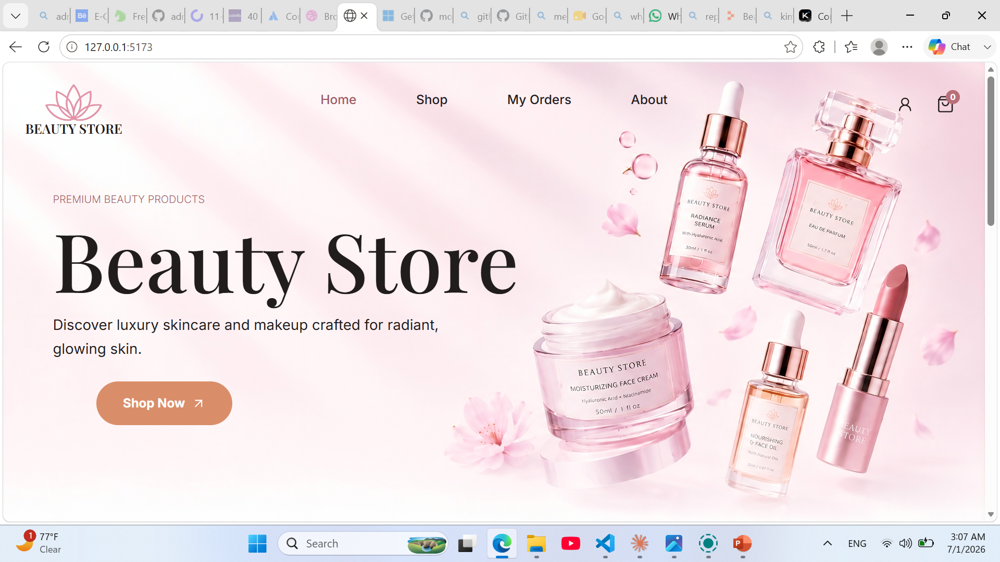
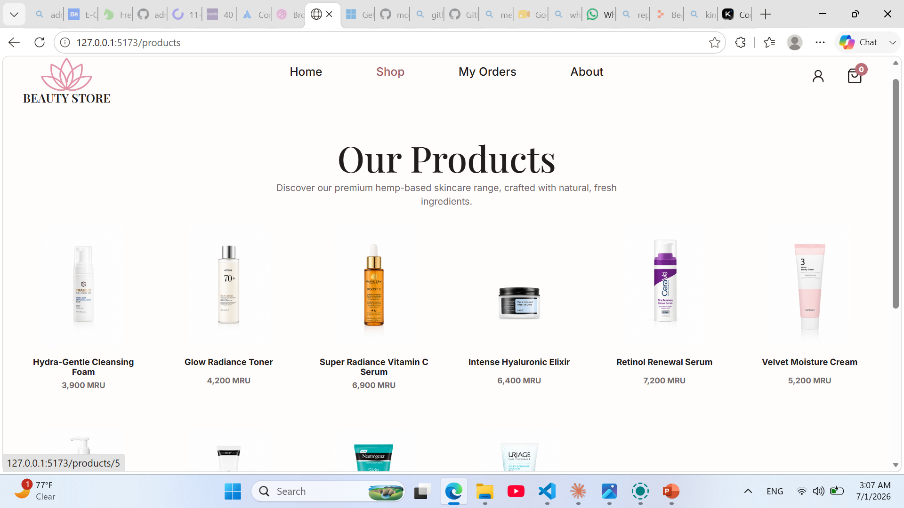
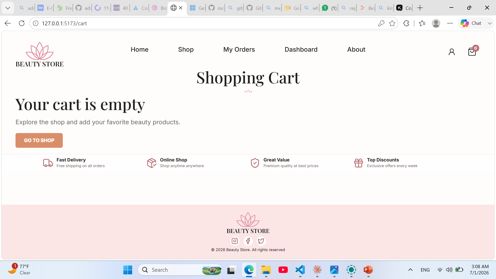
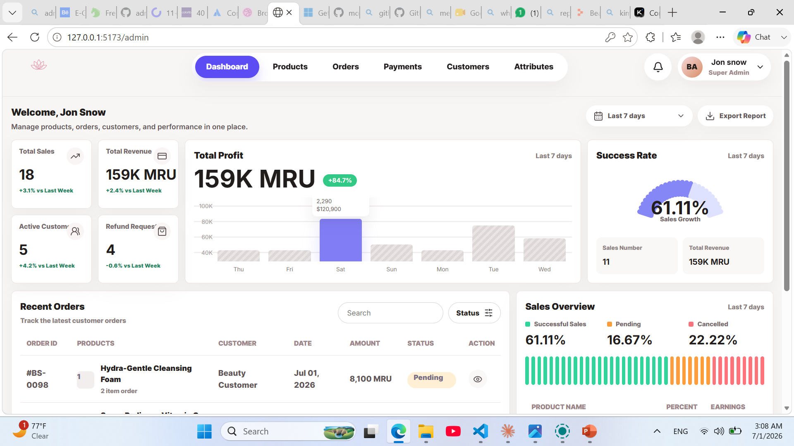
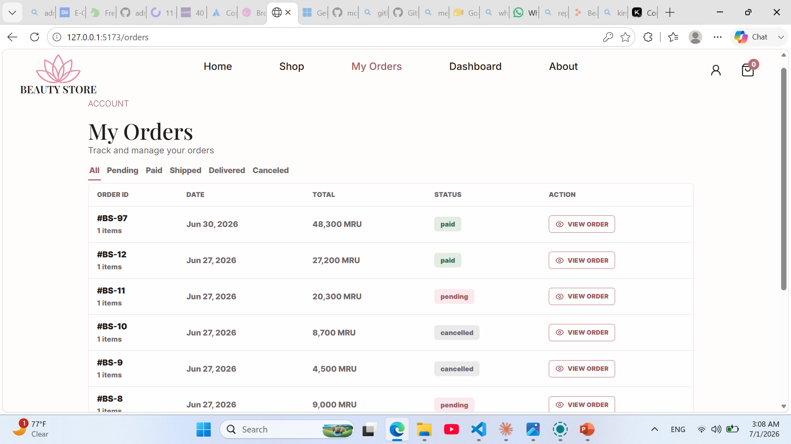
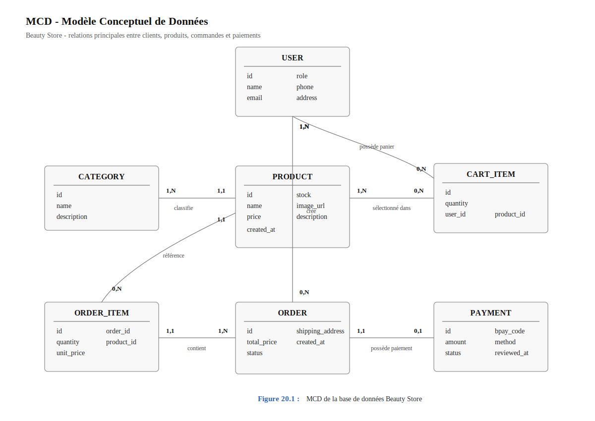
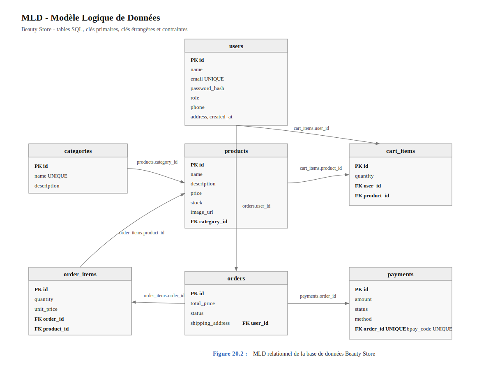

# Rapport du Projet : Beauty Store

## 1. Introduction

Beauty Store est une application web de commerce électronique spécialisée dans les produits de beauté et de soin. Le projet permet aux clients de consulter les produits, d'ajouter des articles au panier, de passer une commande et de suivre son état. Il propose aussi une interface d'administration qui permet au responsable du magasin de gérer les produits, les commandes, les utilisateurs et les paiements.

L'idée principale du projet est de créer une boutique simple, moderne et adaptée au contexte local. Le paiement n'est pas basé sur une carte bancaire internationale, mais sur Bankily B-pay, avec une validation manuelle par l'administrateur.

## 2. Objectif du Projet

L'objectif de Beauty Store est de construire une plateforme complète pour vendre des produits cosmétiques en ligne. Le site doit être facile à utiliser pour le client et pratique pour l'administrateur.

Les objectifs principaux sont :

- afficher les produits de manière claire et attractive ;
- permettre au client d'utiliser le panier sans créer un compte au départ ;
- obliger la connexion uniquement au moment du paiement ;
- créer une commande à partir du panier ;
- enregistrer le code Bankily B-pay envoyé par le client ;
- permettre à l'administrateur d'accepter ou de refuser le paiement ;
- suivre les commandes depuis l'espace client ;
- gérer les produits, les catégories, les utilisateurs et les paiements depuis le tableau de bord.

## 3. Technologies Utilisées

Le projet est divisé en deux grandes parties : le backend et le frontend.

### Backend

Le backend est développé avec FastAPI. Il gère toute la logique serveur : authentification, produits, panier, commandes, paiements, utilisateurs et tableau de bord administrateur.

Technologies principales :

- Python ;
- FastAPI ;
- SQLAlchemy ;
- MySQL ;
- Alembic pour les migrations ;
- JWT pour l'authentification ;
- bcrypt pour le hachage des mots de passe.

### Frontend

Le frontend est développé avec React et JavaScript. Il contient deux parties : l'interface client et l'interface administrateur.

Technologies principales :

- React ;
- Vite ;
- JavaScript ;
- CSS personnalisé ;
- lucide-react pour les icônes ;
- Playwright pour les tests end-to-end.

## 4. Architecture Générale

Le projet est organisé pour séparer les responsabilités.

### Backend

Le dossier backend contient :

- `app/models` : les modèles de base de données ;
- `app/schemas` : les schémas de validation ;
- `app/routes` : les routes API ;
- `app/utils` : les fonctions utiles comme l'authentification et les validations ;
- `uploads/products` : les images des produits ;
- `alembic` : les migrations de base de données ;
- `data/seed_demo_data.py` : script pour insérer les produits et données initiales.

### Frontend

Le dossier frontend est organisé en trois parties :

- `website` : pages et composants du site client ;
- `admin` : pages et composants du tableau de bord ;
- `shared` : API client, contextes, données partagées et fonctions communes.

Cette séparation rend le projet plus clair et plus facile à développer en équipe.

## 5. Fonctionnalités Côté Client

### Page d'accueil

La page d'accueil présente la marque Beauty Store, une image principale, un bouton d'accès au catalogue et une section de produits mis en avant. Les produits affichés viennent de la base de données. Si le backend n'est pas disponible, le frontend possède une liste de secours pour éviter une page vide.

### Page des produits

La page Shop affiche les produits disponibles. Chaque produit montre son image, son nom et son prix. Les images sont stockées côté backend dans le dossier `uploads/products`, et la base de données garde seulement le chemin de l'image.

### Page détails produit

La page détail permet de voir :

- le nom du produit ;
- son prix ;
- sa description ;
- son image ;
- son stock ;
- la quantité à ajouter ;
- le bouton Add to Cart.

Le client peut ajouter un produit au panier sans être connecté.

### Panier

Le panier fonctionne pour les visiteurs et les utilisateurs connectés.

Si le client n'est pas connecté, le panier est stocké localement dans le navigateur. Quand il se connecte, le panier invité peut être synchronisé avec le backend.

Le client peut :

- modifier la quantité ;
- supprimer un produit ;
- voir le total ;
- continuer vers le paiement.

### Authentification

Le client peut créer un compte ou se connecter. La connexion devient obligatoire au moment du checkout. Cela rend l'expérience plus simple, car le client peut d'abord découvrir les produits sans obligation.

Les mots de passe sont hachés côté backend avant d'être stockés.

### Checkout

Pendant le checkout, le client saisit ses informations de livraison et son numéro Bankily. Ce numéro est important car il permet de vérifier le paiement avec le code B-pay.

Le client saisit ensuite un code B-pay de quatre chiffres. Ce code est envoyé au backend avec la commande.

## 6. Système de Paiement Bankily B-pay

Le paiement est manuel. Le client effectue le paiement avec Bankily B-pay, puis il saisit le code de paiement dans le site.

Le processus est le suivant :

1. Le client ajoute des produits au panier.
2. Il se connecte ou crée un compte.
3. Il passe au checkout.
4. Il saisit le code B-pay.
5. Le backend crée une commande et un paiement.
6. Le paiement prend le statut `under_review`.
7. L'administrateur vérifie le paiement.
8. Si le paiement est correct, il l'accepte.
9. Si le paiement est incorrect, il le refuse.

Ce système est adapté au contexte où l'intégration automatique du paiement n'est pas encore disponible.

## 7. Fonctionnalités Administrateur

L'administrateur possède un tableau de bord séparé du site client. Il est accessible uniquement aux utilisateurs ayant le rôle `admin`.

### Dashboard

Le tableau de bord affiche :

- les ventes ;
- le revenu ;
- le nombre de clients ;
- les demandes de remboursement ;
- les graphiques de performance ;
- les commandes récentes ;
- l'état général des commandes.

### Gestion des produits

L'administrateur peut :

- ajouter un produit ;
- modifier un produit ;
- supprimer un produit ;
- changer le prix ;
- changer le stock ;
- ajouter une image produit.

Les images uploadées sont stockées dans :

`backend/uploads/products`

La base de données ne stocke pas l'image elle-même, mais seulement son URL.

### Gestion des commandes

L'administrateur peut voir toutes les commandes. Le bouton View ouvre les détails d'une commande : client, total, statut, adresse et produits commandés.

Il peut aussi changer le statut de la commande selon le workflow autorisé :

- `pending` vers `cancelled` ;
- `paid` vers `shipped` ;
- `shipped` vers `delivered`.

### Gestion des paiements

La page Payments permet de voir les paiements Bankily en attente. L'administrateur peut :

- accepter le paiement ;
- refuser le paiement.

Quand le paiement est accepté, la commande devient payée. Quand le paiement est refusé, le paiement prend le statut rejeté.

### Gestion des utilisateurs

L'administrateur peut consulter les utilisateurs et changer leur rôle entre client et admin.

## 8. Base de Données

La base de données principale est MySQL. Les tables principales sont :

- users ;
- products ;
- categories ;
- cart_items ;
- orders ;
- order_items ;
- payments.

Chaque produit appartient à une catégorie. Chaque commande appartient à un utilisateur. Une commande contient plusieurs lignes de commande. Chaque commande peut avoir un paiement.

Les migrations sont gérées avec Alembic, ce qui permet de faire évoluer la structure de la base de données sans recréer toute la base.

## 9. Sécurité

Le projet inclut plusieurs éléments de sécurité :

- hachage des mots de passe avec bcrypt ;
- authentification par JWT ;
- routes admin protégées ;
- validation des données avec Pydantic ;
- limitation simple sur login/register ;
- logout avec révocation du token en mémoire ;
- restriction du type et de la taille des images uploadées.

Pour une mise en production avancée, il faudra déplacer la gestion des tokens révoqués et du rate limit vers un service partagé comme Redis.

## 10. Stockage des Images

Les images des produits sont stockées dans le backend, dans :

`backend/uploads/products`

Dans la base de données, on garde seulement le chemin :

`/uploads/products/product-name.png`

Cela permet au frontend d'afficher les images depuis l'API backend. Cette méthode est correcte pour un premier déploiement. Pour un grand projet en production, une solution cloud comme Cloudinary, Amazon S3 ou DigitalOcean Spaces serait plus robuste.

## 11. Tests

Le projet contient des tests backend et frontend.

Les tests backend vérifient les routes importantes et utilisent une base SQLite en mémoire pour ne pas modifier la base principale.

Les tests frontend utilisent Playwright pour tester le comportement du site dans le navigateur, notamment le parcours client.

## 12. Lancement du Projet

Un fichier `start-dev.ps1` permet de lancer plus facilement le backend et le frontend pendant le développement.

Le backend fonctionne sur :

`http://localhost:8000`

Le frontend fonctionne sur :

`http://localhost:5173`

## 13. Points Restants à Améliorer

Le projet est fonctionnel, mais certains points peuvent encore être améliorés :

- rendre le paiement automatique si Bankily propose une API officielle ;
- améliorer les tests end-to-end ;
- préparer le déploiement production ;
- ajouter un système de sauvegarde pour les images uploadées ;
- améliorer les graphiques du dashboard ;
- ajouter une meilleure gestion des erreurs côté frontend ;
- préparer Docker si l'équipe veut simplifier l'installation.

## 14. Parcours Client Détaillé

Le parcours client représente la partie la plus visible du projet.

Il doit rester simple, rapide et clair.

Le client ne doit pas être obligé de comprendre la logique interne du système.

Il doit seulement voir les produits, choisir ce qu'il veut, payer et suivre sa commande.

### Étape 1 : arrivée sur la page d'accueil

- le client arrive sur la page Home ;
- il voit l'identité visuelle de Beauty Store ;
- il voit les produits mis en avant ;
- il peut cliquer sur Shop ;
- il peut accéder au panier ;
- il peut se connecter s'il le souhaite.

### Étape 2 : consultation du catalogue

- le client ouvre la page Shop ;
- les produits sont chargés depuis le backend ;
- chaque produit affiche une image ;
- chaque produit affiche un nom ;
- chaque produit affiche un prix ;
- le client peut ouvrir les détails du produit.

### Étape 3 : détails du produit

- le client voit une image plus grande ;
- il lit la description ;
- il voit le prix ;
- il voit le stock ;
- il choisit la quantité ;
- il ajoute le produit au panier.

### Étape 4 : panier

- le panier affiche les produits sélectionnés ;
- le client peut modifier la quantité ;
- le client peut supprimer un produit ;
- le total est recalculé ;
- le client peut continuer ses achats ;
- le client peut passer au checkout.

### Étape 5 : checkout

- si le client n'est pas connecté, il est redirigé vers login ;
- après connexion, il revient vers checkout ;
- il saisit les informations de livraison ;
- il saisit son numéro Bankily ;
- il saisit le code B-pay ;
- il confirme la commande.

### Étape 6 : suivi

- la commande est visible dans My Orders ;
- le statut indique l'état actuel ;
- le client peut voir les détails ;
- il attend la validation du paiement ;
- il suit ensuite l'expédition.

## 15. Parcours Administrateur Détaillé

Le parcours administrateur est séparé du parcours client.

Cette séparation évite de mélanger les responsabilités.

L'administrateur doit avoir une vision rapide de l'activité du magasin.

### Dashboard

- affiche le total des ventes ;
- affiche les revenus ;
- affiche le nombre de clients ;
- affiche les commandes récentes ;
- affiche les paiements en attente ;
- affiche des graphiques de suivi.

### Gestion des produits

- ajouter un produit ;
- modifier un produit ;
- supprimer un produit ;
- changer le prix ;
- changer le stock ;
- changer l'image ;
- changer la catégorie.

### Gestion des commandes

- voir toutes les commandes ;
- ouvrir le détail d'une commande ;
- vérifier le client ;
- vérifier les produits ;
- vérifier le total ;
- changer le statut ;
- suivre le workflow.

### Gestion des paiements

- voir les paiements en attente ;
- vérifier le code B-pay ;
- vérifier le montant ;
- accepter le paiement ;
- refuser le paiement ;
- ajouter une note admin si nécessaire.

### Gestion des clients

- consulter les utilisateurs ;
- distinguer client et admin ;
- suivre les informations utiles ;
- garder le contrôle sur les accès sensibles.

## 16. Détail de la Logique Backend

Le backend contient la logique principale du projet.

Il ne sert pas seulement à envoyer des données.

Il protège aussi les routes, valide les entrées et applique les règles du magasin.

### Authentification

- register crée un nouvel utilisateur ;
- login vérifie l'email et le mot de passe ;
- le mot de passe est comparé avec le hash ;
- un token JWT est généré ;
- le frontend stocke le token ;
- les routes protégées demandent ce token.

### Produits

- les produits sont stockés dans MySQL ;
- l'image n'est pas stockée directement dans la base ;
- la base garde seulement le chemin de l'image ;
- le backend sert les images depuis uploads ;
- le frontend construit l'URL complète avec le client API.

### Panier

- le panier peut exister localement côté frontend ;
- après connexion, il peut être synchronisé ;
- le backend vérifie les produits ;
- le backend vérifie les quantités ;
- le backend calcule les données nécessaires à la commande.

### Commandes

- une commande appartient à un utilisateur ;
- une commande contient plusieurs order_items ;
- chaque order_item garde le prix au moment de l'achat ;
- le stock doit rester cohérent ;
- le statut doit suivre une logique contrôlée.

### Paiements

- le paiement est lié à une commande ;
- le code B-pay doit contenir quatre chiffres ;
- le statut initial est under_review ;
- l'admin peut accepter ;
- l'admin peut refuser ;
- le statut de la commande peut évoluer après validation.

## 17. Détail de la Logique Frontend

Le frontend est responsable de l'expérience utilisateur.

Il affiche les données reçues du backend.

Il gère aussi les états temporaires comme le panier invité.

### Client API

- centralise les appels HTTP ;
- ajoute le token quand il existe ;
- gère les erreurs de requête ;
- transforme les URLs d'images ;
- évite de répéter la même logique dans toutes les pages.

### Pages client

- HomePage affiche l'accueil et les produits ;
- ShopPage affiche le catalogue ;
- ProductDetailsPage affiche un produit ;
- CartPage affiche le panier ;
- PaymentPage ou CheckoutPage finalise l'achat ;
- OrdersPage affiche les commandes du client.

### Pages admin

- AdminDashboardPage affiche les statistiques ;
- AdminProductsPage gère les produits ;
- AdminOrdersPage gère les commandes ;
- AdminPaymentsPage gère les paiements ;
- AdminCustomersPage gère les clients ;
- AdminAttributesPage gère les catégories.

### Gestion de l'état

- l'authentification est partagée ;
- le panier est partagé ;
- les erreurs sont affichées à l'utilisateur ;
- les chargements sont indiqués ;
- les pages sensibles sont protégées.

## 18. Détail des Routes API

Les routes API sont le contrat entre le frontend et le backend.

Une route doit avoir un rôle clair.

Elle doit recevoir des données valides et retourner une réponse compréhensible.

### Routes Auth

- `/api/auth/register` ;
- `/api/auth/login` ;
- `/api/auth/logout` ;
- `/api/auth/me`.

Ces routes servent à créer un compte, se connecter, se déconnecter et récupérer l'utilisateur courant.

### Routes Produits

- `/api/products/` ;
- `/api/products/{id}` ;
- routes admin pour créer ;
- routes admin pour modifier ;
- routes admin pour supprimer.

Ces routes permettent d'afficher et de gérer le catalogue.

### Routes Panier

- ajouter un produit ;
- modifier la quantité ;
- supprimer un produit ;
- vider le panier ;
- récupérer le panier.

Ces routes peuvent être utilisées quand le panier est côté backend.

### Routes Commandes

- créer une commande ;
- récupérer les commandes du client ;
- récupérer une commande précise ;
- récupérer toutes les commandes côté admin ;
- changer le statut côté admin.

### Routes Paiements

- soumettre un code B-pay ;
- récupérer les paiements en attente ;
- accepter un paiement ;
- refuser un paiement ;
- consulter l'état du paiement.

### Routes Admin

- dashboard ;
- statistiques ;
- rapports ;
- utilisateurs ;
- données de synthèse.

## 19. Détail de la Base de Données

La base de données est la mémoire du projet.

Elle doit garder les informations importantes de manière cohérente.

### Table users

- identifiant ;
- nom ;
- email ;
- mot de passe hashé ;
- rôle ;
- téléphone ;
- adresse ;
- date de création.

### Table products

- identifiant ;
- nom ;
- description ;
- prix ;
- stock ;
- image_url ;
- category_id ;
- date de création.

### Table categories

- identifiant ;
- nom ;
- description éventuelle ;
- relation avec les produits.

### Table cart_items

- identifiant ;
- user_id ;
- product_id ;
- quantité ;
- date d'ajout.

### Table orders

- identifiant ;
- user_id ;
- total ;
- statut ;
- adresse de livraison ;
- téléphone ;
- date de création.

### Table order_items

- identifiant ;
- order_id ;
- product_id ;
- quantité ;
- prix unitaire ;
- sous-total.

### Table payments

- identifiant ;
- order_id ;
- bpay_code ;
- bankily_phone ;
- montant ;
- statut ;
- note admin ;
- date de création.

## 20. Modèles MCD et MLD

Cette partie présente la structure conceptuelle et logique de la base de données utilisée dans Beauty Store.

Le MCD montre les entités principales et leurs relations.

Le MLD traduit ces relations sous forme de tables, de clés primaires et de clés étrangères.

### MCD - Modèle Conceptuel de Données

Entités principales :

- USER ;
- CATEGORY ;
- PRODUCT ;
- CART_ITEM ;
- ORDER ;
- ORDER_ITEM ;
- PAYMENT.

Relations principales :

- USER possède zéro ou plusieurs CART_ITEM ;
- PRODUCT peut apparaître dans zéro ou plusieurs CART_ITEM ;
- USER crée zéro ou plusieurs ORDER ;
- ORDER contient une ou plusieurs ORDER_ITEM ;
- PRODUCT peut apparaître dans zéro ou plusieurs ORDER_ITEM ;
- CATEGORY classe zéro ou plusieurs PRODUCT ;
- ORDER possède zéro ou un PAYMENT ;
- PAYMENT appartient à une seule ORDER.

Représentation textuelle du MCD :

- USER 1,N ---- owns ---- 0,N CART_ITEM ;
- PRODUCT 1,N ---- selected in ---- 0,N CART_ITEM ;
- USER 1,N ---- creates ---- 0,N ORDER ;
- ORDER 1,N ---- contains ---- 1,N ORDER_ITEM ;
- PRODUCT 1,N ---- appears in ---- 0,N ORDER_ITEM ;
- CATEGORY 1,N ---- classifies ---- 0,N PRODUCT ;
- ORDER 1,1 ---- has ---- 0,1 PAYMENT.

### MLD - Modèle Logique de Données

users(
id PK,
name,
email UNIQUE,
password_hash,
role,
phone,
address,
created_at
)

categories(
id PK,
name UNIQUE,
description
)

products(
id PK,
name,
description,
price,
stock,
image_url,
category_id FK vers categories(id),
created_at
)

cart_items(
id PK,
quantity,
user_id FK vers users(id),
product_id FK vers products(id),
UNIQUE(user_id, product_id)
)

orders(
id PK,
total_price,
status,
shipping_address,
created_at,
user_id FK vers users(id)
)

order_items(
id PK,
quantity,
unit_price,
order_id FK vers orders(id),
product_id FK vers products(id)
)

payments(
id PK,
amount,
status,
created_at,
method,
order_id FK vers orders(id) UNIQUE,
bpay_code UNIQUE,
admin_note,
reviewed_at
)

### Explication du modèle

Un utilisateur peut créer plusieurs commandes.

Une commande contient plusieurs lignes de commande.

Une ligne de commande garde le produit, la quantité et le prix unitaire au moment de l'achat.

Un produit appartient à une catégorie.

Un panier contient les produits sélectionnés par un utilisateur.

La contrainte UNIQUE(user_id, product_id) empêche d'avoir deux fois le même produit dans le panier du même utilisateur.

Un paiement est lié à une seule commande grâce à order_id UNIQUE.

Le code B-pay est unique pour empêcher la réutilisation du même code dans plusieurs paiements.

## 21. Règles Métier Importantes

Les règles métier évitent les comportements incorrects.

Elles donnent une logique stable au projet.

### Règles produit

- un produit doit avoir un nom ;
- un produit doit avoir un prix positif ;
- un produit doit avoir un stock positif ou nul ;
- une image doit être valide ;
- une catégorie peut organiser le catalogue.

### Règles panier

- la quantité doit être supérieure à zéro ;
- le total doit être recalculé ;
- un produit supprimé ne doit plus apparaître ;
- un panier invité ne doit pas être perdu avant checkout.

### Règles commande

- une commande doit appartenir à un utilisateur ;
- une commande doit contenir au moins un produit ;
- le total doit être calculé côté backend ;
- le statut ne doit pas changer librement ;
- le stock doit rester logique.

### Règles paiement

- le code B-pay doit contenir quatre chiffres ;
- un paiement doit être lié à une commande ;
- un paiement en attente doit être visible par l'admin ;
- un paiement accepté doit faire avancer la commande ;
- un paiement refusé doit rester traçable.

### Règles admin

- seul un admin peut accéder au dashboard ;
- seul un admin peut modifier les produits ;
- seul un admin peut accepter un paiement ;
- seul un admin peut changer les statuts sensibles.

## 22. Sécurité Détaillée

La sécurité est importante dans une application e-commerce.

Même si le projet est encore en développement, plusieurs protections existent.

### Mots de passe

- les mots de passe ne sont pas stockés en clair ;
- bcrypt est utilisé ;
- le backend compare le mot de passe avec le hash ;
- même l'administrateur ne doit pas connaître le mot de passe réel.

### Tokens

- JWT identifie l'utilisateur connecté ;
- le token est envoyé dans les requêtes protégées ;
- logout révoque le token en mémoire ;
- une solution comme Redis serait meilleure en production.

### Rôles

- client ;
- admin.

Le rôle admin donne accès au dashboard.

Le rôle client reste limité aux pages normales.

### Validation

- Pydantic vérifie les données ;
- les emails sont validés ;
- les quantités sont contrôlées ;
- le code B-pay est contrôlé ;
- les uploads sont limités.

### Risques restants

- ajouter une protection CSRF si nécessaire ;
- renforcer le rate limit ;
- ajouter une journalisation plus détaillée ;
- protéger les fichiers uploads en production ;
- surveiller les erreurs serveur.

## 23. Tests et Validation Détaillés

Les tests servent à vérifier que le projet fonctionne après chaque modification.

Ils évitent de casser une partie déjà terminée.

### Tests backend

- tester le lancement de l'application ;
- tester l'inscription ;
- tester la connexion ;
- tester les produits ;
- tester les commandes ;
- tester les paiements ;
- tester les routes admin.

### Tests frontend

- tester l'ouverture de la page Home ;
- tester l'ajout au panier ;
- tester la page panier ;
- tester le checkout ;
- tester la connexion ;
- tester l'affichage des commandes ;
- tester le dashboard admin.

### Tests manuels

- créer un compte client ;
- ajouter un produit ;
- passer une commande ;
- soumettre un code B-pay ;
- se connecter comme admin ;
- accepter le paiement ;
- vérifier le changement de statut.

### Validation visuelle

- vérifier les images ;
- vérifier les espacements ;
- vérifier les boutons ;
- vérifier les pages sur mobile ;
- vérifier les pages sur desktop.

## 24. Performance et Organisation du Code

La performance ne concerne pas seulement la vitesse.

Elle concerne aussi la manière dont le code reste facile à comprendre.

### Côté frontend

- Vite accélère le développement ;
- les pages sont séparées ;
- les composants layout sont partagés ;
- les images utilisent object-fit ;
- les appels API sont centralisés.

### Côté backend

- FastAPI est rapide ;
- SQLAlchemy structure l'accès aux données ;
- Alembic évite les modifications manuelles de tables ;
- les routes sont classées par domaine ;
- les images ne sont pas stockées en base.

### Côté base de données

- MySQL garde les données principales ;
- les relations évitent la duplication ;
- les index importants peuvent être ajoutés ;
- les migrations gardent un historique.

### Points à surveiller

- pagination des produits ;
- pagination des commandes ;
- compression des images ;
- logs serveur ;
- sauvegardes régulières.

## 25. Préparation au Déploiement

Le déploiement demande une configuration plus stricte que le développement local.

Il faut préparer le backend, le frontend, la base et les fichiers uploadés.

### Backend en production

- configurer `DATABASE_URL` ;
- configurer `SECRET_KEY` ;
- configurer CORS ;
- lancer Alembic ;
- vérifier le dossier uploads ;
- activer les logs ;
- utiliser un serveur ASGI stable.

### Frontend en production

- configurer `VITE_API_URL` ;
- lancer `npm run build` ;
- servir le dossier dist ;
- vérifier les routes React ;
- vérifier les URLs des images.

### Base de données

- créer la base MySQL ;
- créer un utilisateur MySQL dédié ;
- limiter les permissions ;
- appliquer les migrations ;
- sauvegarder régulièrement.

### Images

- garder `backend/uploads/products` ;
- sauvegarder le dossier ;
- vérifier les permissions ;
- envisager Cloudinary ou S3 plus tard.

## 26. Limites Actuelles

Le projet est solide, mais il n'est pas encore parfait.

Certaines limites sont normales à ce stade.

### Paiement

- le paiement est manuel ;
- l'admin doit vérifier le code ;
- il n'y a pas encore de confirmation automatique ;
- une API Bankily officielle serait meilleure.

### Dashboard

- le design a été amélioré ;
- certaines statistiques peuvent encore être enrichies ;
- les graphiques peuvent être plus précis ;
- les filtres peuvent être ajoutés.

### Frontend

- certains messages d'erreur peuvent être améliorés ;
- certaines pages peuvent être plus compactes ;
- les états loading peuvent être plus visibles ;
- l'accessibilité peut être renforcée.

### Backend

- plus de tests peuvent être ajoutés ;
- plus de logs peuvent être ajoutés ;
- Redis serait utile pour rate limit et logout ;
- la gestion des permissions peut être affinée.

## 27. Améliorations Futures

Après la version actuelle, plusieurs améliorations sont possibles.

### Améliorations court terme

- ajouter plus de tests ;
- améliorer les messages d'erreur ;
- améliorer la page admin products ;
- ajouter un filtre par catégorie ;
- ajouter une recherche produit ;
- améliorer la page order details ;
- améliorer les emails de confirmation.

### Améliorations moyen terme

- ajouter un vrai système de notifications ;
- ajouter un historique des actions admin ;
- ajouter des statistiques par période ;
- ajouter la gestion des stocks bas ;
- ajouter un export CSV ;
- ajouter une sauvegarde automatique.

### Améliorations long terme

- paiement automatique Bankily si API disponible ;
- stockage cloud des images ;
- Docker ;
- CI/CD ;
- monitoring ;
- hébergement production complet ;
- application mobile éventuelle.

## 28. Bilan Général

Beauty Store est plus qu'une simple interface.

C'est une application complète avec logique client et logique administrateur.

Le projet couvre les besoins essentiels d'une boutique en ligne.

### Ce qui est déjà bien avancé

- interface client ;
- catalogue ;
- panier ;
- checkout ;
- commandes ;
- paiement Bankily manuel ;
- dashboard admin ;
- gestion des produits ;
- gestion des paiements ;
- stockage des images ;
- structure frontend séparée ;
- backend organisé.

### Ce qui reste à renforcer

- automatisation du paiement ;
- tests plus complets ;
- déploiement production ;
- sauvegarde des images ;
- amélioration des statistiques ;
- meilleure gestion des erreurs.

## 29. Conclusion

Beauty Store est une application e-commerce complète adaptée à la vente de produits de beauté. Le projet contient une interface client, un panier, un système de commande, un paiement Bankily B-pay avec validation manuelle et un tableau de bord administrateur.

Le projet est déjà bien structuré et peut évoluer facilement. Il reste surtout à renforcer les tests, préparer le déploiement et améliorer certains détails du dashboard. La base actuelle est solide pour continuer vers une version plus professionnelle.
